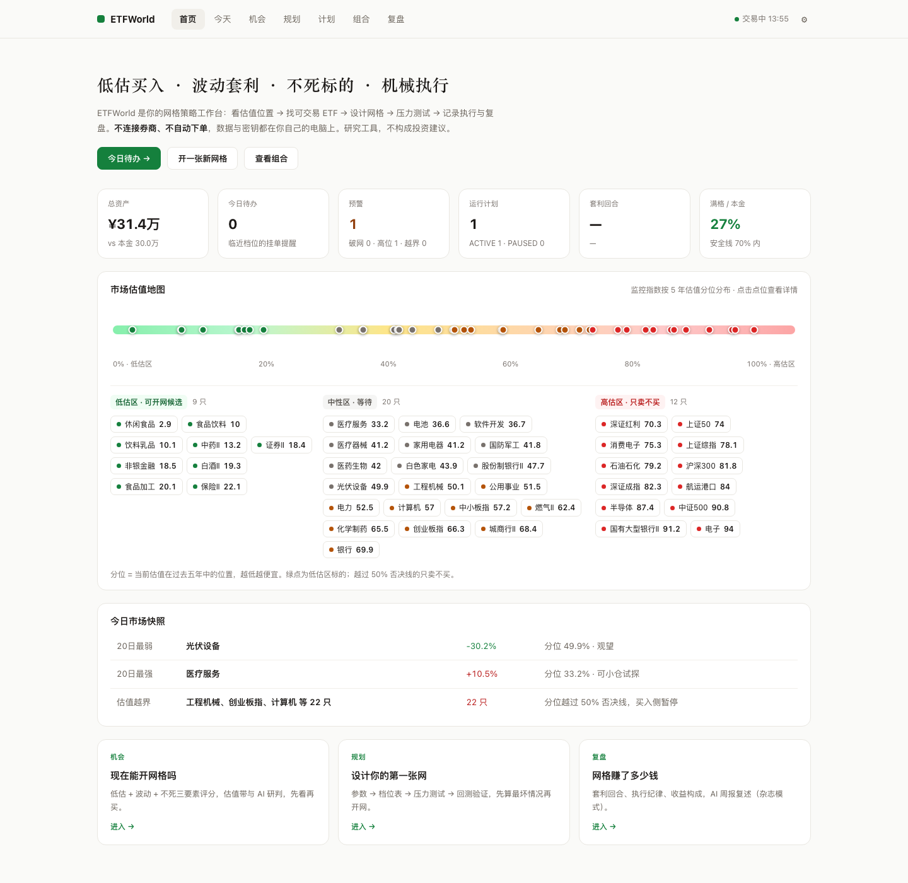
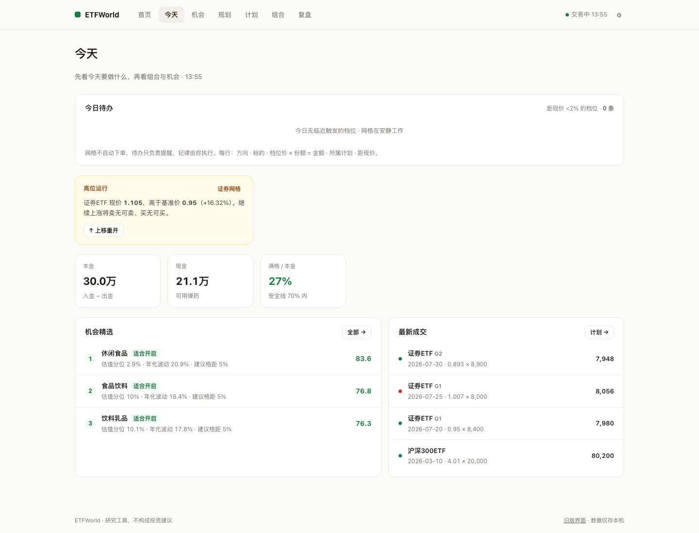
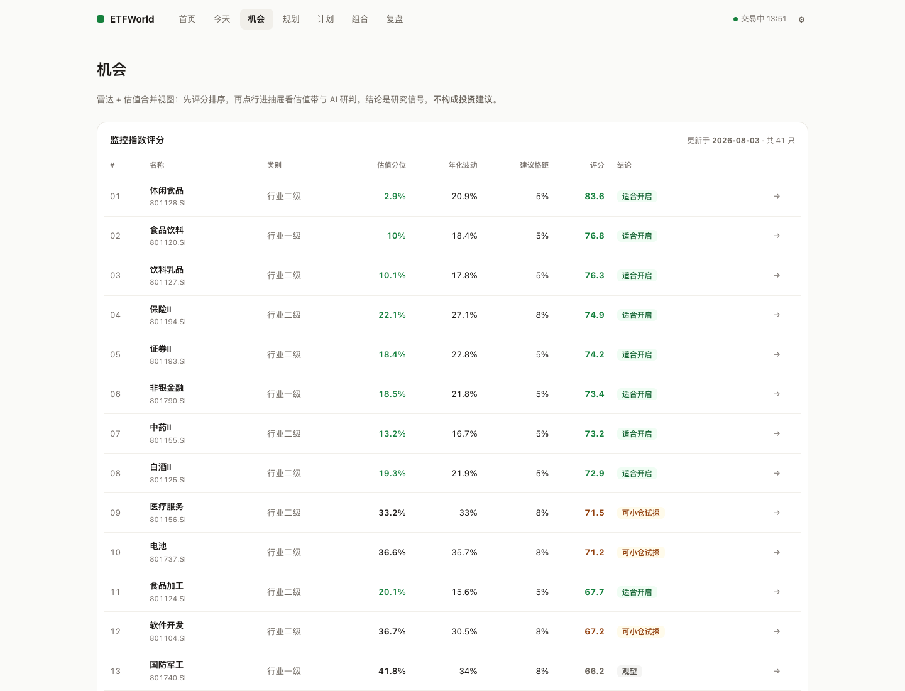
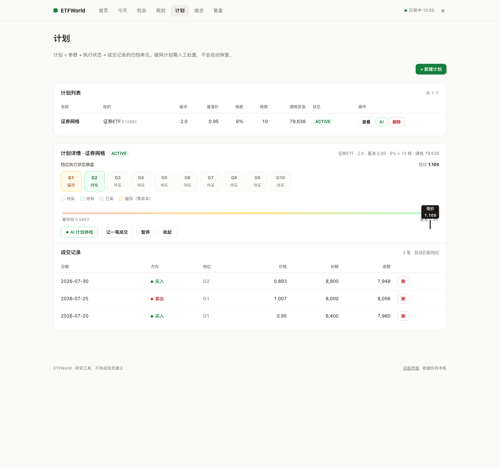
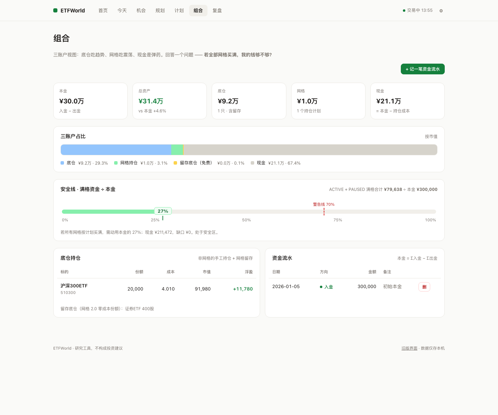

# ETFWorld

一个面向个人投资者的本地 ETF 估值与网格策略工作台。

ETFWorld 把指数估值、ETF 查找、网格规划、执行跟踪、组合管理和复盘放进一个桌面应用。数据与密钥默认保存在自己的电脑中，不需要注册账号，也不会连接券商执行交易。


> ETFWorld 仅用于学习与辅助研究，不构成任何投资建议。市场有风险，投资决策与盈亏由使用者自行承担。



## 为什么做 ETFWorld

个人 ETF 研究经常分散在行情网站、估值表格、网格计算器和交易记录之间。不同工具的数据口径不一致，计划与执行也很难连续保存。

ETFWorld 希望提供一个简单、透明、本地优先的工作空间，覆盖网格策略的完整生命周期：

1. 先看指数当前处于怎样的历史估值位置，能不能开网。
2. 寻找对应的可交易 ETF，按波动率建议格距。
3. 根据价格与资金规模设计网格档位，执行前先看满格资金和最深浮亏。
4. 执行中记录成交、跟踪每一格的买卖状态，破了网有处置路径，涨穿了能一键上移重开。
5. 定期复盘：套利回合、执行纪律、收益构成，到底谁在赚钱一目了然。

项目受到长期指数投资与网格交易理念启发，但与任何作者、社区或机构不存在官方关联。

## 功能地图

| 页签 | 回答的问题 |
|------|-----------|
| **首页** | 我的组合和整个市场现在什么状态？估值地图一屏看完全部监控指数 |
| **今天** | 今天要做什么？临近档位的挂单提醒 + 破网/高位/估值越界三盏预警灯 |
| **机会** | 现在能开网格吗？估值分位 + 波动率的就绪度评分，点行进详情抽屉 |
| **规划** | 这张网怎么设计？档位表、压力测试、历史回测、参数寻优 |
| **计划** | 网格跑到哪了？档位执行棋盘（待买/持有/已卖/留存）、破网处置、AI 计划体检 |
| **组合** | 钱够不够？底仓/网格/现金三账户，满格资金 ÷ 本金的安全线 |
| **复盘** | 赚了多少、纪律如何？回合统计、违约计数、收益构成、AI 周报（杂志模式） |

<table>
  <tr>
    <td></td>
    <td></td>
  </tr>
  <tr>
    <td></td>
    <td></td>
  </tr>
</table>

### 核心机制

- **网格 1.0 / 2.0**：每跌一格买入、回升一格卖出；2.0 支持"留利润"——卖出时保留部分利润份额，长期积累零成本底仓。档位价格几何对称：买入价 = 基准价 × (1−格距)ⁱ，卖出价 = 买入价 ÷ (1−格距)。
- **执行感知**：录入成交时按方向和价格自动匹配档位（±1.5% 容差），棋盘状态、留存份额、待办提醒全部由真实成交推导。
- **估值闸门**：分位 >50% 的品种雷达直接否决；上移重开计划时会先检查当前分位再确认。
- **破网处置**：跌破最低档后三选一——装死持有 / 向下接网（以现价重开）/ 止损归档，每条路径写清代价。

### 可选 AI 研判

可接入任意兼容 OpenAI Chat Completions 协议的模型服务（DeepSeek、Kimi、SiliconFlow 等），对已有估值与波动数据生成研究性解读：指数研判、计划体检、组合周报。AI 定位是研究助手，不输出买卖指令；结果按（标的, 数据日期）缓存。未配置时不影响任何其他功能。

## 产品边界

ETFWorld 是研究与记录工具，不是交易系统：

- 不连接券商，不自动下单
- 不预测市场涨跌，不承诺收益
- 不提供投资组合或个性化投资建议
- 不内置作者的 Token、交易记录或个人数据库
- 不随安装包分发第三方历史行情
- 不保证外部数据源始终可用或实时准确

所有估值、评分、回测和 AI 内容都应结合原始数据独立判断。

## 使用桌面版

从 [GitHub Releases](https://github.com/LiuShiYi1027/ETFWorld/releases) 下载最新版本：

- **macOS**（Apple Silicon）：解压后将 `ETFWorld.app` 移入"应用程序"。未签名的构建首次打开需在 Finder 中右键选择"打开"。
- **Windows**：解压后运行 `ETFWorld.exe`。未签名的构建首次运行可能触发 SmartScreen 提示，选择"仍要运行"即可。

首次启动会进入**首启向导**：阅读免责说明 → 填入自己的 Tushare Token → 回填历史数据，三步完成初始化。用户数据存放在：

```text
macOS:   ~/Library/Application Support/ETFWorld/
Windows: %APPDATA%\ETFWorld\
```

升级或重新安装不会覆盖这里的数据。

> 维护者说明：在仓库 Variables 中设置 `MACOS_SIGNING=true` 并配置签名 Secrets（见 `.github/workflows/release.yml` 注释）后，Release 流水线会自动产出签名+公证的 macOS 构建。

## 从源码运行

建议使用 Python 3.10 或更高版本。

```bash
git clone https://github.com/LiuShiYi1027/ETFWorld.git
cd ETFWorld
./start.sh        # 创建 venv、装依赖、启动 Web 服务
```

然后访问 <http://127.0.0.1:8000>。桌面壳模式：`python desktop.py`。

旧版单文件前端（/legacy）与简单模式（/simple）为迁移期保留页面，将在后续版本移除。

## 配置数据源

桌面版推荐在应用内「⚙ 设置」完成配置。源码运行时也可以复制环境变量模板：

```bash
cp backend/.env.example backend/.env
```

```dotenv
TUSHARE_TOKEN=你的Token
TUSHARE_API_URL=https://ttx.dailyfetch.top/

# 可选：AI 研判（任意 OpenAI 兼容端点，示例如 DeepSeek）
AI_API_KEY=
AI_API_URL=https://api.deepseek.com/chat/completions
AI_MODEL=deepseek-chat
```

真实 `.env` 已被 Git 忽略。不要在 Issue、日志或提交记录中公开任何 API Key。

## 初始化估值数据

开源仓库和安装包不包含历史行情数据库。配置 Tushare 后，可以在首启向导或命令行更新数据：

```bash
# 回填一段历史数据
python -m backend.init --backfill --start 20150101 --end 20260101

# 更新最近一个已发布数据的交易日
python -m backend.init --update
```

历史回填可能需要相应的数据接口权限并产生调用消耗。请遵守数据提供方的服务条款，不要在未经许可的情况下重新分发市场数据。

## 本地数据与隐私

- 桌面后端仅监听 `127.0.0.1`
- SQLite 数据库保存在系统用户数据目录
- API Key 保存在本机配置文件中，不会通过设置接口回传完整值
- 删除应用不会自动删除用户数据库
- 当前 API 按本地单用户工具设计，请勿直接暴露到公网

## 开发与打包

```bash
# 运行测试（含网格核心、组合层、执行匹配、纪律统计等 65+ 用例）
pip install pytest httpx
python -m pytest

# 构建桌面应用
pyinstaller ETFWorld.spec --clean --noconfirm           # macOS（产出 ETFWorld.app）
pyinstaller ETFWorld-windows.spec --clean --noconfirm   # Windows（产出 dist/ETFWorld/）
```

项目结构与约定见 [AGENTS.md](AGENTS.md)。构建过程不会读取或打包项目根目录中的 `etfworld.db` 和 `.env`。

更多使用说明见 [使用文档](docs/使用文档.md)。

## 参与贡献

欢迎提交 Issue 与 Pull Request，包括：

- 修复数据处理或网格计算问题
- 改进桌面端体验与可访问性
- 增加测试和文档
- 补充不同操作系统的构建验证

涉及评分规则或投资结论的修改，请同时说明数据依据、假设条件和可能的局限。前端设计走查记录保存在 `.impeccable/critique/`。

## License

[MIT License](LICENSE)
